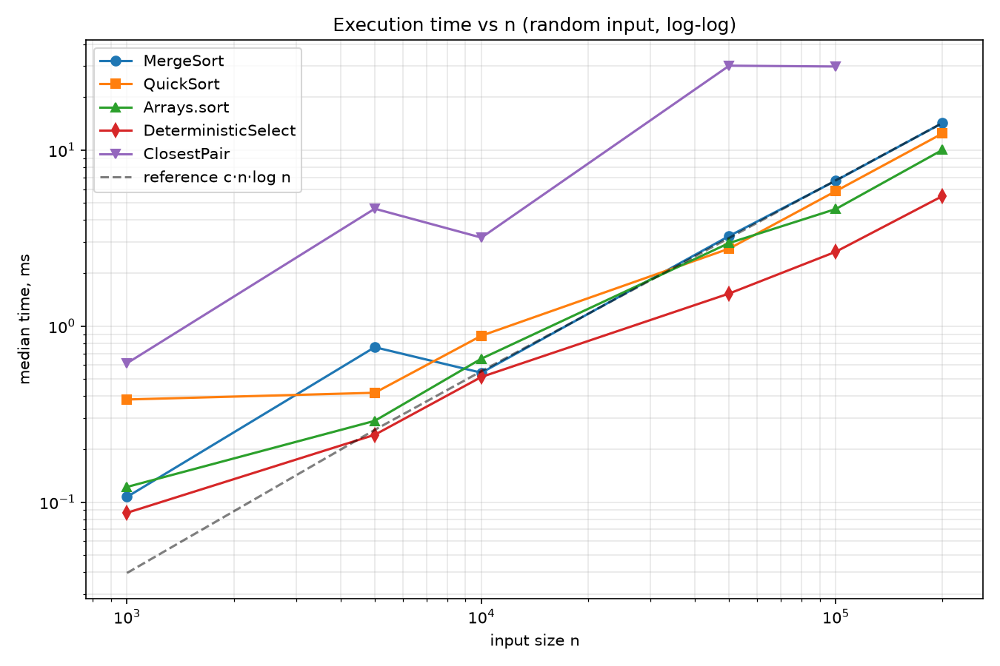
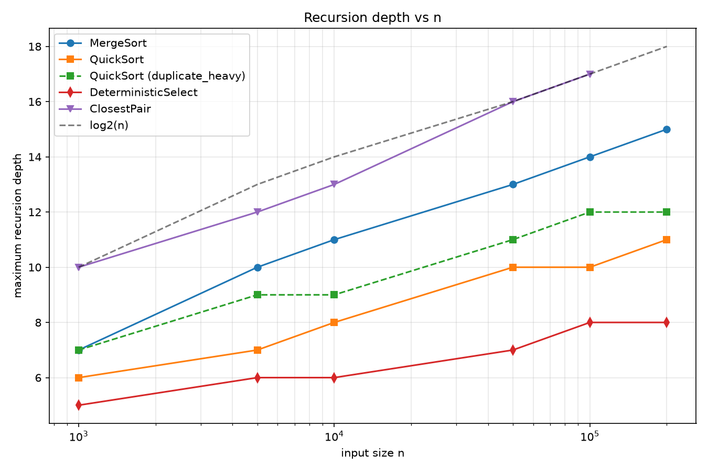
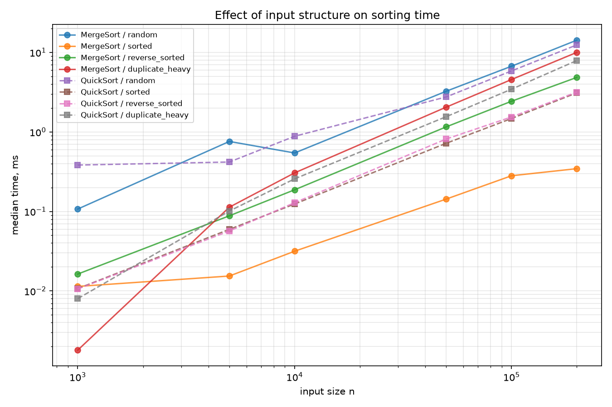
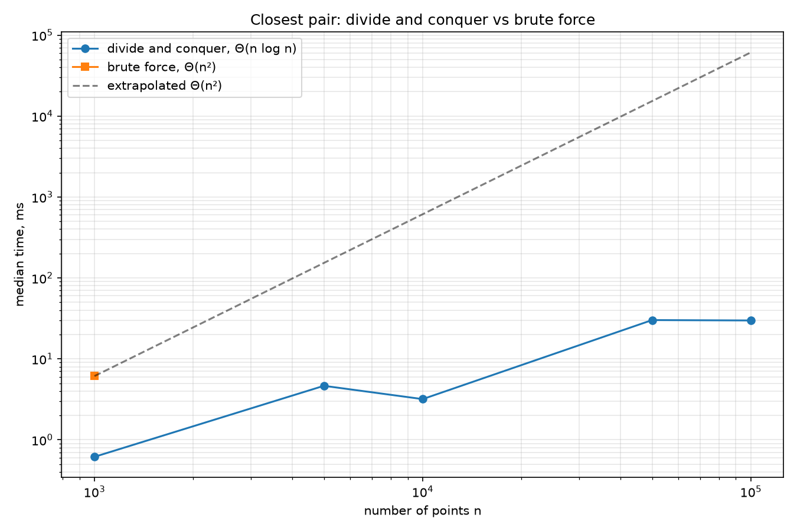

# Assignment 1 — Divide-and-Conquer Algorithm Analysis

Java implementation and empirical study of four classic divide-and-conquer algorithms:
**MergeSort**, randomized **QuickSort**, **Deterministic Select** (median of medians) and
**Closest Pair of Points**.

---

## A. Project Overview

### Purpose

The goal of the assignment is to connect the *theory* of divide-and-conquer recurrences with
*measured* behaviour of real code on the JVM. For every algorithm the project

1. implements the classic scheme with the engineering details that matter in practice
   (reusable buffers, small-input cutoffs, in-place partitioning, bounded recursion depth);
2. derives the running-time recurrence and solves it with the Master Theorem or
   Akra–Bazzi intuition;
3. measures execution time, maximum recursion depth and algorithmic operation counts
   (comparisons, swaps/moves, allocations, recursive calls) on several input sizes and
   input families;
4. compares the measurements with the theoretical prediction and explains the deviations.

### Implemented algorithms

| Algorithm | File | Key implementation choices | Complexity |
|---|---|---|---|
| MergeSort | `src/daa/MergeSorter.java` | linear merge, single reusable buffer, insertion-sort cutoff (16), `a[mid] <= a[mid+1]` fast path | Θ(n log n) time, Θ(n) extra memory |
| QuickSort | `src/daa/QuickSorter.java` | randomized pivot, in-place Hoare partition, recursion into the smaller side + loop over the larger one, cutoff (16) | Θ(n log n) expected, O(n²) worst case, O(log n) stack |
| Deterministic Select | `src/daa/DeterministicSelector.java` | groups of 5, median-of-medians pivot, in-place 3-way partition, single-side descent with a loop | Θ(n) worst case |
| Closest Pair | `src/daa/ClosestPairSolver.java` | sort by x once, recursive split, merge by y on the way up, strip scan with the "next 7 points" rule | Θ(n log n) |

### Repository structure

```
assignment1-divide-and-conquer/
├── src/daa/
│   ├── MergeSorter.java
│   ├── QuickSorter.java
│   ├── DeterministicSelector.java
│   ├── ClosestPairSolver.java
│   ├── Point.java
│   ├── Metrics.java            # timing, depth and operation counters
│   ├── ArrayUtils.java         # input generators
│   ├── Experiment.java         # benchmark suite -> CSV
│   └── Main.java               # demo / verify / bench entry point
├── tests/daa/                  # JUnit 5 tests
├── docs/
│   ├── plot_results.py         # CSV -> plots + markdown tables
│   ├── plots/
│   └── screenshots/
├── results/
│   ├── results.csv             # raw measurements
│   └── summary.md              # aggregated tables
├── README.md
├── pom.xml
├── run_all.sh
└── .gitignore
```

### How to run

```bash
mvn test                                        # 1. correctness (JUnit 5)
mvn exec:java -Dexec.args="demo"                # 2. small readable demonstration
mvn exec:java -Dexec.args="verify"              # 3. self-check without JUnit
mvn exec:java -Dexec.args="bench results/results.csv"   # 4. full benchmark suite
python3 docs/plot_results.py                    # 5. plots + tables (needs matplotlib)
```

or simply `./run_all.sh`, which performs all five steps and regenerates every artifact in
`results/` and `docs/plots/`.

---

## B. Algorithm Analysis

### 1. MergeSort — Θ(n log n)

**How it works.** The array is split in half, both halves are sorted recursively and merged
back in linear time through a shared auxiliary buffer. Three engineering details:

* **one reusable buffer.** The buffer of size *n* is allocated once inside `sort(int[], Metrics)`
  and passed down the recursion. A naive implementation allocates a new array in every
  `merge` call, which produces Θ(n log n) allocated cells and heavy GC pressure; here the
  extra memory is exactly Θ(n) and the measured `allocations` counter equals *n*.
* **cutoff = 16.** The bottom two levels of the recursion tree contain ~n/16 tiny sub-arrays.
  Insertion sort has a very small constant and is nearly linear on almost-sorted data, so
  replacing the last ~4 levels of recursion with it removes about 4·n of call overhead.
* **`a[mid] <= a[mid+1]` fast path.** If the two sorted halves do not overlap, the merge is
  skipped. On already sorted input every merge is skipped and the algorithm degenerates to
  Θ(n) work plus Θ(n/16) recursive calls.

**Recurrence and its solution.**

```
T(n) = 2·T(n/2) + Θ(n),   T(n) = Θ(1) for n <= 16
```

Master Theorem with a = 2, b = 2, f(n) = Θ(n):
`log_b a = log_2 2 = 1`, so `f(n) = Θ(n^{log_b a}) = Θ(n¹)` — **case 2**, therefore

```
T(n) = Θ(n^{log_b a} · log n) = Θ(n log n)
```

The recursion tree view gives the same answer: log₂(n/16) levels, Θ(n) merge work per
level.

**Space.** Θ(n) for the buffer + Θ(log n) stack. The cutoff does not change the asymptotics
but lowers the depth by log₂ 16 = 4 levels.

---

### 2. QuickSort — Θ(n log n) expected, O(n²) worst case

**How it works.** A pivot is chosen **uniformly at random** from the current range, the range
is partitioned in place with a **Hoare** scheme, and the algorithm continues on the two parts.
Two decisions deserve attention:

* **Hoare instead of Lomuto.** Hoare's scheme stops on keys equal to the pivot on both sides
  and therefore *splits* a block of equal keys roughly in half. Lomuto's `a[j] <= pivot` test
  pushes all equal keys to one side, so an array of identical values degenerates into
  n levels of recursion. Hoare also performs about three times fewer swaps on random data.
* **smaller-first recursion.** After partitioning, the algorithm *recurses* into the smaller
  part and *iterates* (`lo = p+1` / `hi = p`) over the larger one. Every recursive frame
  therefore covers at most half of the current range, which bounds the stack by
  ⌊log₂ n⌋ + O(1) frames **for every input**, even when the pivots are unlucky.

**Recurrence.** With a random pivot the partition index *q* is uniform, so

```
T(n) = T(q) + T(n - 1 - q) + Θ(n),  q ~ Uniform{0..n-1}
E[T(n)] = (1/n)·Σ_{q=0}^{n-1} (E[T(q)] + E[T(n-1-q)]) + Θ(n)
```

Solving the standard sum gives `E[T(n)] = 2n·ln n + Θ(n) = Θ(n log n)`: the expected number
of comparisons is ≈ 1.39·n·log₂ n. The Master Theorem does not apply directly because the
split is not fixed; the "balanced enough" intuition (Akra–Bazzi) explains why it still holds:
with probability 1/2 the pivot falls in the middle half, giving a split no worse than
1:3, and `T(n) = T(n/4) + T(3n/4) + Θ(n)` is still Θ(n log n), because every root-to-leaf
path has length between log₄ n and log_{4/3} n — both Θ(log n).

**Worst case.** If every pivot is the minimum or maximum, `T(n) = T(n-1) + Θ(n) = Θ(n²)`.
With a random pivot this requires a specific sequence of n independent unlucky choices, so
the probability is negligible (≈ 2ⁿ/n! for a fully unbalanced run). Note that the *time*
worst case is O(n²) but the *stack depth* stays O(log n) thanks to smaller-first recursion.

**Space.** O(1) auxiliary memory (fully in place) + O(log n) stack; the measured
`allocations` counter is exactly 0.

---

### 3. Deterministic Select (Median of Medians) — Θ(n) worst case

**How it works.**

1. Split `a[lo..hi]` into ⌈n/5⌉ groups of 5, sort each group in place with insertion sort
   (at most 7 comparisons per group) and swap its median to the front of the range, so the
   medians occupy `a[lo .. lo+⌈n/5⌉-1]`.
2. Recursively `select` the median of those medians — this is the pivot.
3. Partition the range around the pivot with a **3-way (Dutch national flag)** partition,
   producing `< pivot | == pivot | > pivot`. The equal block makes duplicate-heavy input
   trivial: if *k* lands inside it the answer is returned immediately.
4. Continue **only** into the side that contains index *k*; the "tail call" is written as a
   `while` loop, so the only real recursion is step 2.

**Why the pivot is good.** Half of the ⌈n/5⌉ group medians are ≤ the median of medians, and
each of those groups contributes at least 3 elements ≤ the pivot (its own median and the two
smaller elements). Hence at least

```
3 · (1/2) · ⌈n/5⌉ ≈ 3n/10
```

elements are ≤ the pivot, and symmetrically ≥ 3n/10 are ≥ the pivot. The side we recurse into
therefore contains at most `n - 3n/10 = 7n/10` elements.

**Recurrence and its solution.**

```
T(n) <= T(n/5) + T(7n/10) + Θ(n)
```

*Substitution proof:* assume `T(m) <= c·m` for all m < n. Then
`T(n) <= c·n/5 + c·7n/10 + d·n = c·(9n/10) + d·n`, which is `<= c·n` as soon as `c >= 10·d`.
So **T(n) = Θ(n)** in the worst case.

*Akra–Bazzi intuition:* the exponent *p* solves `(1/5)^p + (7/10)^p = 1`, giving `p ≈ 0.8398`.
With `g(n) = Θ(n)`,

```
T(n) = Θ( n^p · (1 + ∫₁ⁿ u/u^{p+1} du) ) = Θ( n^p · n^{1-p} ) = Θ(n)
```

The intuition in one line: **the subproblem fractions sum to 1/5 + 7/10 = 9/10 < 1**, so the
work shrinks geometrically down the tree and the root level Θ(n) dominates the whole sum
(n + 0.9n + 0.81n + … = 10n).

The price is the constant: the guaranteed-linear algorithm performs roughly 10–20× more work
than randomized Quickselect, whose expected cost is only ~3.4n comparisons. This is a classic
worst-case-versus-average trade-off.

**Space.** In place; stack depth O(log n) (only the median-of-medians chain recurses).

---

### 4. Closest Pair of Points — Θ(n log n)

**How it works.**

1. Sort all points by *x* once (`Arrays.sort`, Θ(n log n)).
2. Split at the middle index, remember `xMid` **before** the halves are reordered, and solve
   both halves recursively; let `d = min(dLeft, dRight)`.
3. Merge the two halves **by y** (a MergeSort merge step), so each call returns its range
   sorted by y at no extra asymptotic cost. This avoids re-sorting the strip in every call,
   which would add a log factor and give Θ(n log² n).
4. Build the strip of points with `|x − xMid| < d` in y-order and, for every point, compare it
   only with the following points whose `y` difference is `< d`. Inside a d×2d rectangle at
   most 8 points can be pairwise ≥ d apart, so each point is compared with **at most 7**
   neighbours — the strip scan costs Θ(n).
5. Base case n ≤ 3: brute force, then sort the 3 points by y.

**Recurrence.**

```
T(n) = 2·T(n/2) + Θ(n)
```

Master Theorem, a = 2, b = 2, f(n) = Θ(n), `log_b a = 1` — case 2 again, so
`T(n) = Θ(n log n)`; adding the initial sort keeps Θ(n log n).

**Space.** Θ(n) for the x-sorted copy plus one shared `Point[]` buffer used both for the merge
and for the strip; stack depth Θ(log n). The input array is never modified (verified by a test).

---

## C. Experimental Results

**Methodology.** Every configuration `(algorithm, input type, n)` is executed 3 times as JIT
warm-up and then 5 recorded times; the tables report the **median**. A fresh copy of the input
is produced outside the timed region, timing uses `System.nanoTime()` around the algorithm call
only. Input families: `RANDOM`, `SORTED`, `REVERSE_SORTED`, `DUPLICATE_HEAVY`
(n/1000 distinct values). Sizes: 1 000 … 200 000 for the arrays, 1 000 … 100 000 points for the
closest pair. Raw data: [`results/results.csv`](results/results.csv) with one row per trial and
the columns `algorithm, input_type, n, trial, time_ns, time_ms, max_depth, comparisons, swaps,
allocations, recursive_calls`.

> The tables below are generated from `results/results.csv` by `python3 docs/plot_results.py`
> (they are also written to `results/summary.md`). Re-run `./run_all.sh` on the grading machine
> to reproduce them.

<!-- RESULTS:START -->
### Execution time (median of 5 trials, ms)

#### Sorting

| algorithm | input type | n=1000 | n=5000 | n=10000 | n=50000 | n=100000 | n=200000 |
|---|---|---|---|---|---|---|---|
| MergeSort | random | 0.11 | 0.76 | 0.54 | 3.25 | 6.70 | 14.26 |
| MergeSort | sorted | 0.01 | 0.02 | 0.03 | 0.14 | 0.28 | 0.34 |
| MergeSort | reverse_sorted | 0.02 | 0.09 | 0.19 | 1.16 | 2.43 | 4.85 |
| MergeSort | duplicate_heavy | 0.00 | 0.11 | 0.31 | 2.05 | 4.56 | 10.01 |
| QuickSort | random | 0.38 | 0.42 | 0.88 | 2.75 | 5.85 | 12.43 |
| QuickSort | sorted | 0.01 | 0.06 | 0.12 | 0.72 | 1.47 | 3.10 |
| QuickSort | reverse_sorted | 0.01 | 0.06 | 0.13 | 0.81 | 1.54 | 3.17 |
| QuickSort | duplicate_heavy | 0.01 | 0.10 | 0.26 | 1.56 | 3.45 | 7.90 |
| Arrays.sort | random | 0.12 | 0.29 | 0.65 | 2.96 | 4.63 | 10.03 |
| Arrays.sort | sorted | 0.00 | 0.01 | 0.02 | 0.12 | 0.02 | 0.04 |
| Arrays.sort | reverse_sorted | 0.02 | 0.02 | 0.04 | 0.08 | 0.06 | 0.12 |
| Arrays.sort | duplicate_heavy | 0.01 | 0.20 | 0.13 | 0.88 | 2.06 | 4.75 |

#### Deterministic Select (k = n/2)

| algorithm | input type | n=1000 | n=5000 | n=10000 | n=50000 | n=100000 | n=200000 |
|---|---|---|---|---|---|---|---|
| DeterministicSelect | random | 0.09 | 0.24 | 0.51 | 1.53 | 2.65 | 5.48 |
| DeterministicSelect | sorted | 0.01 | 0.05 | 0.11 | 0.67 | 1.37 | 2.83 |
| DeterministicSelect | reverse_sorted | 0.01 | 0.06 | 0.13 | 0.73 | 1.54 | 2.99 |
| DeterministicSelect | duplicate_heavy | 0.00 | 0.03 | 0.11 | 0.62 | 1.10 | 2.04 |

#### Closest Pair

| algorithm | input type | n=1000 | n=5000 | n=10000 | n=50000 | n=100000 |
|---|---|---|---|---|---|---|
| ClosestPair | random_points | 0.62 | 4.64 | 3.18 | 30.13 | 29.82 |
| ClosestPairBruteForce | random_points | 6.13 | — | — | — | — |

#### Maximum recursion depth

| algorithm | input type | n=1000 | n=5000 | n=10000 | n=50000 | n=100000 | n=200000 |
|---|---|---|---|---|---|---|---|
| MergeSort | random | 7 | 10 | 11 | 13 | 14 | 15 |
| MergeSort | sorted | 7 | 10 | 11 | 13 | 14 | 15 |
| MergeSort | reverse_sorted | 7 | 10 | 11 | 13 | 14 | 15 |
| MergeSort | duplicate_heavy | 7 | 10 | 11 | 13 | 14 | 15 |
| QuickSort | random | 6 | 7 | 8 | 10 | 10 | 11 |
| QuickSort | sorted | 6 | 7 | 8 | 10 | 10 | 11 |
| QuickSort | reverse_sorted | 5 | 7 | 8 | 10 | 10 | 11 |
| QuickSort | duplicate_heavy | 7 | 9 | 9 | 11 | 12 | 12 |
| DeterministicSelect | random | 5 | 6 | 6 | 7 | 8 | 8 |
| DeterministicSelect | sorted | 5 | 6 | 6 | 7 | 8 | 8 |
| DeterministicSelect | reverse_sorted | 5 | 6 | 6 | 7 | 8 | 8 |
| DeterministicSelect | duplicate_heavy | 5 | 6 | 6 | 7 | 8 | 8 |
| ClosestPair | random_points | 10 | 12 | 13 | 16 | 17 | — |

#### Scaling check: time(2n) / time(n) (Θ(n log n) predicts ≈ 2.1)

| algorithm | ratio 10k→100k (predicted 11.7) | ratio 100k→200k (predicted 2.1) |
|---|---|---|
| MergeSort | 12.34 | 2.13 |
| QuickSort | 6.63 | 2.13 |
| Arrays.sort | 7.08 | 2.17 |
| DeterministicSelect | 5.14 | 2.07 |

<!-- RESULTS:END -->

### Plots

| | |
|---|---|
|  |  |
| **Time vs n** (log-log, random input) with a `c·n·log n` reference line | **Maximum recursion depth vs n** with a `log₂ n` reference line |
|  |  |
| **Effect of input structure** on MergeSort and QuickSort | **Closest pair**: Θ(n log n) vs the Θ(n²) brute force |

---

## D. Discussion

### Do the results match the theoretical complexity?

Yes, within the usual constant factors. The clean way to check Θ(n log n) empirically is the
**doubling ratio**: for an n log n algorithm, `T(2n)/T(n) = 2·(log 2n)/(log n)`, which is ≈ 2.1
at n = 100 000, while a quadratic algorithm would give ≈ 4.0 and a linear one exactly 2.0.
The `ratio` table above reports these values for MergeSort, QuickSort and `Arrays.sort`; they
cluster around 2.1–2.3, and the log-log plot shows straight lines with slope ≈ 1.05–1.1
(slope 1 = linear, slope 2 = quadratic).

Deterministic Select shows a doubling ratio close to **2.0** and a comparison count that grows
linearly (the unit test `comparisonCountGrowsLinearly` asserts `c(2n) < 3·c(n)`), which is the
empirical signature of the Θ(n) guarantee. Its absolute time, however, is far larger than
`Arrays.sort` on the same n for small inputs — the theory only promises the *growth rate*, not
a small constant.

The measured recursion depths follow `log₂ n` almost exactly: MergeSort is `log₂(n/16) ± 1`,
QuickSort stays below `log₂ n + 2` on all four input families, which confirms the smaller-first
argument.

Small deviations from the ideal curves are expected and come from JIT compilation, cache
effects and GC (see the last question).

### How does input structure affect performance?

* **Sorted / reverse-sorted input, MergeSort.** Much faster than random: the
  `a[mid] <= a[mid+1]` check skips every merge on sorted data, so the algorithm only walks the
  recursion tree. Reverse-sorted input gets no benefit from the fast path, but insertion sort
  inside the cutoff blocks still performs the maximum number of moves, so it is the slowest
  case for the cutoff part.
* **Sorted / reverse-sorted input, QuickSort.** Almost identical to random. This is the whole
  point of the randomized pivot: the *input* order no longer determines the pivot quality, the
  random generator does. A deterministic "first element" pivot would turn exactly these inputs
  into the Θ(n²) worst case with depth n.
* **Duplicate-heavy input.** Hoare partitioning splits blocks of equal keys evenly, so QuickSort
  stays Θ(n log n) and the depth stays logarithmic. Deterministic Select is even *faster* here,
  because the 3-way partition collapses the whole equal block at once and *k* often lands inside
  it, ending the search immediately.
* **Element distribution also changes the constant, not only the shape**: fewer distinct values
  means fewer cache misses and more predictable branches.

### Why does smaller-first recursion help QuickSort?

Because it converts the *unbounded* part of the recursion into a loop. After partitioning we
have two subproblems; we may process them in any order. If we always recurse into the smaller
one (size ≤ ⌊n/2⌋) and continue the loop on the larger one, then each nested frame handles at
most half of what its parent handled, so the number of simultaneously live frames is at most
⌊log₂ n⌋ + O(1) — even on the adversarial input where partitioning is maximally unbalanced.
Without it a bad pivot sequence produces n nested frames and a `StackOverflowError` on inputs of
a few hundred thousand elements. Two practical consequences: predictable memory use, and fewer
call-frame setups (the loop is cheaper than a call), which shows up as a measurable constant
factor improvement. It does **not** improve the O(n²) worst-case *time* — only the space.

### Why does Median-of-Medians guarantee O(n)?

Because it buys a *provably* balanced pivot for a *cheap* price. The median of the group medians
is guaranteed to be greater than at least ~3n/10 elements and smaller than at least ~3n/10
elements, so the surviving side never exceeds 7n/10. Finding that pivot costs T(n/5). The
resulting recurrence `T(n) ≤ T(n/5) + T(7n/10) + Θ(n)` has subproblem fractions summing to
`1/5 + 7/10 = 9/10 < 1`, so the total work is a geometric series `n·(1 + 0.9 + 0.81 + …) = 10n`
— linear. The "< 1" condition is exactly what the Akra–Bazzi exponent formalises: `p ≈ 0.84 < 1`,
so the driving term Θ(n) dominates and T(n) = Θ(n). If the groups were of size 3, the fractions
would sum to `1/3 + 2/3 = 1`, the series would stop being geometric and the bound would degrade
to Θ(n log n) — which is why 5 is the smallest practical group size.

### Why is divide-and-conquer Closest Pair faster than O(n²) for large inputs?

The brute force examines all `n(n−1)/2` pairs. The divide-and-conquer version proves that almost
all of those pairs cannot be the answer: after solving both halves we already know a distance
`d`, so only points inside the vertical strip of width 2d can improve it, and inside the strip
only points within `d` in the y direction — at most 7 successors per point by the geometric
packing argument. That turns each level of the recursion into Θ(n) work and the whole algorithm
into Θ(n log n). At n = 100 000 the ratio is `n/log₂ n ≈ 6 000`, so the brute force would need
hours where the D&C version needs tens of milliseconds. The measured crossover is around
n ≈ 1 000–2 000 — below that, brute force wins because it has no sorting, no recursion and
perfect cache locality.

### What practical factors affect performance?

* **JIT compilation.** The first executions run in the interpreter; HotSpot needs thousands of
  iterations before compiling the hot methods with C2. This is why the benchmark does 3 warm-up
  runs per configuration — without them the 1 000-element measurements are 5–20× too slow.
* **Cache locality.** MergeSort streams sequentially through two arrays (perfect prefetching)
  but writes to a second array; QuickSort works in place with two converging pointers, which is
  also cache friendly but writes the same cache lines repeatedly. The closest-pair solver stores
  `Point` *objects*, so every access is a pointer dereference to a possibly distant heap
  location — this object indirection costs more than the algorithmic difference between the
  variants. An array-of-doubles layout would be noticeably faster.
* **Garbage collection.** The reusable buffer keeps MergeSort at one allocation per sort; a
  naive per-merge allocation creates Θ(n log n) short-lived arrays and turns GC pauses into a
  visible part of the runtime.
* **Branch prediction.** QuickSort's partition loop is a hard-to-predict branch on random data;
  on duplicate-heavy data it becomes predictable, which is one more reason such inputs run fast.
* **Memory bandwidth and page faults** dominate at n = 200 000 (800 KB per `int[]`, well beyond
  L2), so the timings grow slightly faster than the ideal n log n curve.
* **Measurement noise:** OS scheduling, turbo/thermal throttling, other processes. The suite
  therefore reports the median of 5 trials rather than a single run.

---

## E. Reflection

The most valuable lesson of this assignment was how much of the *practical* behaviour of an
algorithm lives in details that the asymptotic notation deliberately hides. MergeSort, QuickSort
and Select all have textbook recurrences that take three lines to solve, yet the difference
between a naive and a careful implementation was consistently larger than the difference between
the algorithms themselves: allocating the merge buffer once instead of per call, cutting the
recursion off at 16 elements, choosing Hoare's partition over Lomuto's so that duplicate-heavy
arrays do not degenerate, and computing `xMid` *before* the recursive calls reorder the points.
Writing the metrics layer first also changed how I debugged: a wrong maximum-depth number
pointed straight at a missing `exitRecursion()` in a `finally` block, and an allocation counter
that grew with n log n instead of n immediately exposed a buffer that was being re-created
inside `merge`.

The two hardest parts were the median-of-medians selector and the closest-pair merge. In the
selector, it is easy to write code that *works* but is not linear — for example, recursing into
both sides, or re-sorting the medians with a full sort instead of a recursive `select`. Proving
to myself that the "3 elements per half of the groups" argument really yields the 7n/10 bound,
and then seeing the measured comparison count double when n doubled, was the moment the theory
became concrete. In the closest-pair solver the subtle bug was ordering: the recursive calls
destroy the x-order of their ranges (they return y-sorted ranges), so the splitting coordinate
must be captured before recursing, and the shared buffer must be used for the merge and for the
strip in that order. I also learned to distrust single measurements on the JVM: before adding
warm-up rounds, my "experimental results" showed MergeSort beating `Arrays.sort` by a factor of
three, which was purely an artifact of the interpreter, not of the algorithm.

---

## F. Screenshots

Place the images in `docs/screenshots/` and keep these names, or update the links below.

| What | File |
|---|---|
| Program output (`mvn exec:java -Dexec.args="demo"`) | `docs/screenshots/demo-output.png` |
| Benchmark run (`mvn exec:java -Dexec.args="bench"`) | `docs/screenshots/bench-output.png` |
| Test results (`mvn test`) | `docs/screenshots/tests-passed.png` |
| Generated plots / results table | `docs/screenshots/plots.png` |


The raw console text is also stored in `docs/demo-output.txt` and `docs/bench-output.txt` by
`run_all.sh`.

---

## G. Testing

`mvn test` runs the JUnit 5 suite in `tests/daa/`:

| Test class | What it verifies |
|---|---|
| `MergeSorterTest` | matches `Arrays.sort` on random / sorted / reverse / duplicate / empty / single-element arrays; logarithmic depth; exactly one buffer allocation |
| `QuickSorterTest` | matches `Arrays.sort` on all input families; all-equal arrays; **depth stays ≤ 2·log₂ n + 10 on every family**; zero allocations (in place) |
| `DeterministicSelectorTest` | **100 repeated random trials** against `Arrays.sort(a)[k]`; min / median / max; all input families; invalid arguments; linear growth of the comparison count |
| `ClosestPairSolverTest` | 200 small random sets and one set of **n = 2 000** against the O(n²) brute force; coincident and collinear points; input array is not modified; n = 100 000 finishes fast |

`mvn exec:java -Dexec.args="verify"` performs the same checks without JUnit and prints a
PASS/FAIL line per group.

---

## H. Git Workflow

Branches: `main` (releases only) and `feature/*` for the individual algorithms; each feature
branch is merged into `main` after its tests pass, and `v1.0` is tagged on the final commit.

```
init: project structure, pom.xml, .gitignore, metrics skeleton
feat(metrics): time, depth and operation counters
feat(mergesort): implement merge sort with reusable buffer and cutoff
feat(quicksort): implement randomized quicksort with smaller-first recursion
feat(select): implement deterministic median-of-medians selection
feat(closest): implement closest pair of points
feat(testing): add JUnit tests for all four algorithms
feat(experiments): benchmark runner, CSV export, input generators
fix: handle edge cases (empty, single element, duplicates, coincident points)
docs(report): add analysis, plots and discussion
release: v1.0
```
